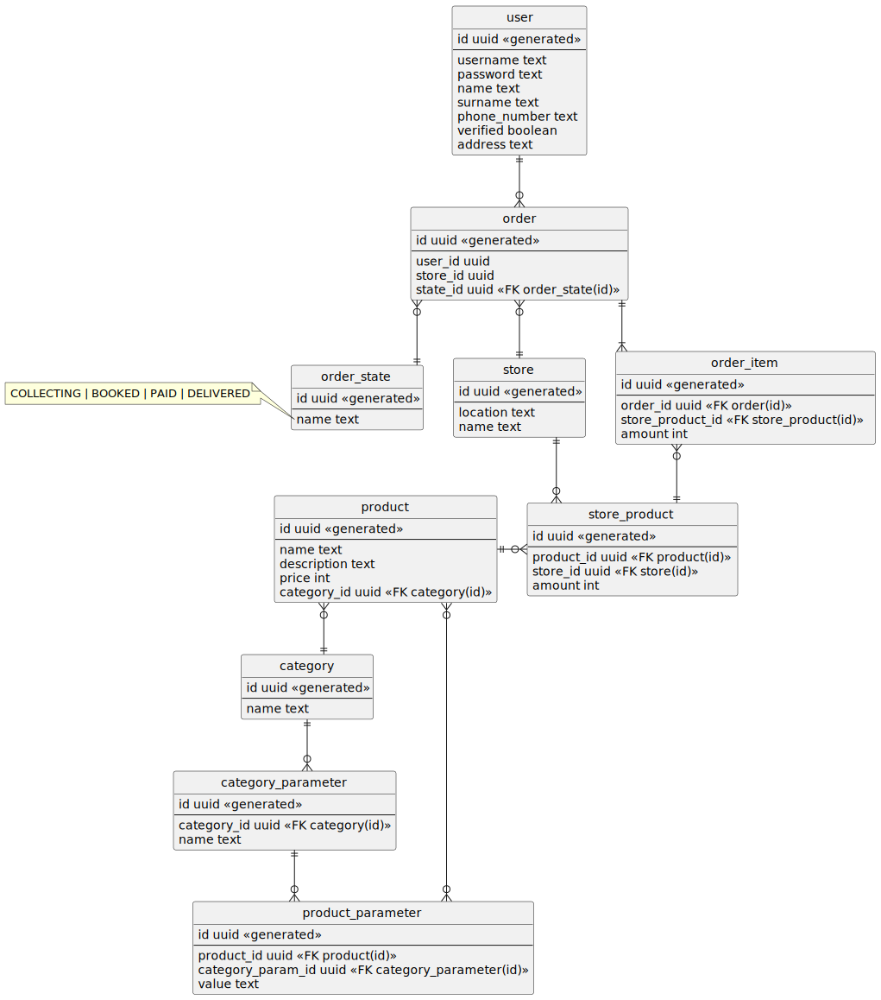
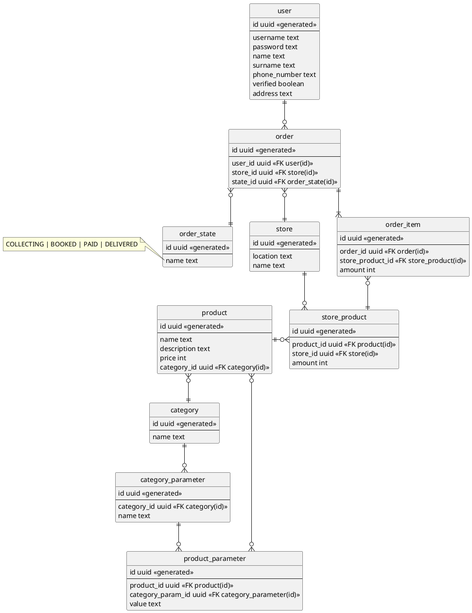

<h2 style="text-align: center;">МИНИСТЕРСТВО ОБРАЗОВАНИЯ И НАУКИ РОССИЙСКОЙ ФЕДЕРАЦИИ 
ФЕДЕРАЛЬНОЕ ГОСУДАРСТВЕННОЕ АВТОНОМНОЕ ОБРАЗОВАТЕЛЬНОЕ
УЧРЕЖДЕНИЕ ВЫСШЕГО ОБРАЗОВАНИЯ
</h2>

«Национальный исследовательский университет ИТМО»

Факультет информационных технологий и программирования

<h3 style="text-align: center;">Лабораторная работа №1</h3>

по предмету “Проектирование баз данных” Вариант 1

Выполнил студент группы M34051 
Кузнецов Илья

Преподаватель Демина Л.С.

Санкт-Петербург 2022

Вариант 1. Заказ продуктов, товаров в магазине

### Краткое описание предметной области и портала, в том числе пояснение, охватывает ли моделирование все данные или только те, которые относятся к некоторым бизнес-процессам (указать к каким)

Система должна позволять пользователю выполнить заказ 
из выбранного (или ближайшего) магазина / склада.
Наличие продуктов в разных магазинах может отличаться.
Характеристики продуктов разных категорий различны 
(так, молочные продукты обладают характеристиками "% жирности" и "объем", а колбаса обладает характеристиками "масса" и "вид мяса"). 
Корзина пользователя рассматривается как заказ в начальном состоянии.

### Модель данных, построенная с учетом заданных требований

### Обоснование нахождения модели данных в 3НФ

1НФ: Каждый кортеж отношения содержит только одно значение для каждого из атрибутов.

2НФ: Все атрибуты зависят от потенциального ключа (в модели данных отсутствуют атрибуты, которые не зависят от первичного ключа)

3НФ: Отсутствуют транзитивные функциональные зависимости от потенциального ключа

НФБК: Не существует функциональных зависимостей, в которых левая часть не является потенциальным ключом
