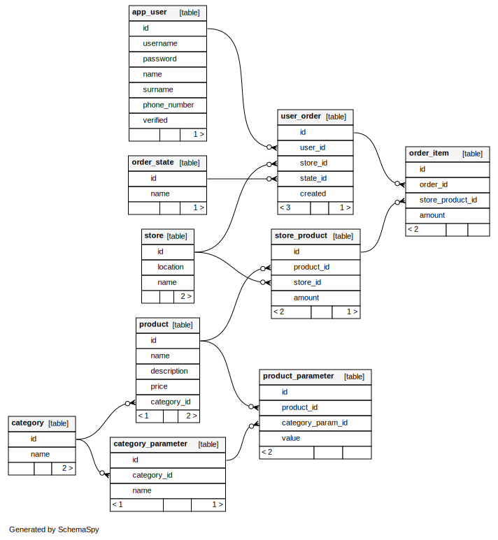

<h2 style="text-align: center;">МИНИСТЕРСТВО ОБРАЗОВАНИЯ И НАУКИ<br/>РОССИЙСКОЙ ФЕДЕРАЦИИ<br/>
ФЕДЕРАЛЬНОЕ ГОСУДАРСТВЕННОЕ АВТОНОМНОЕ ОБРАЗОВАТЕЛЬНОЕ
УЧРЕЖДЕНИЕ ВЫСШЕГО ОБРАЗОВАНИЯ
</h2>

<p style="text-align: center;">«Национальный исследовательский университет ИТМО»</p>

<p style="text-align: center; margin-bottom: 200px">Факультет информационных технологий и программирования</p>

<h3 style="text-align: center;">Лабораторная работа №2</h3>

<p style="text-align: center; margin-bottom: 150px">по предмету “Проектирование баз данных”<br/>Вариант 1</p>

<p style="margin-left: 400px">Выполнил студент группы M34051<br/>
Кузнецов Илья</p>

<p style="margin-left: 400px; margin-bottom: 250px">Преподаватель Демина Л.С.</p>

<p style="text-align: center; margin-bottom: 50px">Санкт-Петербург<br/>2022</p>

Вариант 1. Заказ продуктов, товаров в магазине

### 1. Инициализация схемы

SQL-скрипт:

```sql
CREATE EXTENSION IF NOT EXISTS "uuid-ossp";

CREATE TABLE category (
    id uuid PRIMARY KEY DEFAULT uuid_generate_v4(),
    name text NOT NULL
);

CREATE TABLE product (
    id uuid PRIMARY KEY DEFAULT uuid_generate_v4(),
    name text NOT NULL UNIQUE,
    description text,
    price int NOT NULL,
    category_id uuid REFERENCES category(id) NOT NULL
);

CREATE TABLE category_parameter (
    id uuid PRIMARY KEY DEFAULT uuid_generate_v4(),
    category_id uuid REFERENCES category(id) NOT NULL,
    name text NOT NULL
);

CREATE TABLE product_parameter (
    id uuid PRIMARY KEY DEFAULT uuid_generate_v4(),
    product_id uuid REFERENCES product(id) NOT NULL,
    category_param_id uuid REFERENCES category_parameter(id) NOT NULL,
    value text NOT NULL
);

CREATE TABLE store (
    id uuid PRIMARY KEY DEFAULT uuid_generate_v4(),
    location text NOT NULL,
    name text NOT NULL
);

CREATE TABLE store_product (
    id uuid PRIMARY KEY DEFAULT uuid_generate_v4(),
    product_id uuid REFERENCES product(id) NOT NULL,
    store_id uuid REFERENCES store(id) NOT NULL,
    amount int NOT NULL
);

CREATE TABLE app_user (
    id uuid PRIMARY KEY DEFAULT uuid_generate_v4(),
    username text NOT NULL,
    password text NOT NULL,
    name text NOT NULL,
    surname text NOT NULL,
    phone_number text NOT NULL,
    verified boolean NOT NULL DEFAULT false
);

CREATE TABLE order_state (
    id uuid PRIMARY KEY DEFAULT uuid_generate_v4(),
    name text NOT NULL
);

CREATE TABLE user_order (
    id uuid PRIMARY KEY DEFAULT uuid_generate_v4(),
    user_id uuid REFERENCES app_user(id) NOT NULL,
    store_id uuid REFERENCES store(id) NOT NULL,
    state_id uuid REFERENCES order_state(id) NOT NULL
);

CREATE TABLE order_item (
    id uuid PRIMARY KEY DEFAULT uuid_generate_v4(),
    order_id uuid REFERENCES user_order(id) NOT NULL,
    store_product_id uuid REFERENCES store_product(id) NOT NULL,
    amount int NOT NULL DEFAULT 1
);
```

Сгенерированная на основе схемы данных диаграмма:



### 2. Заполнение данных

**Заполнение данных с помощью SQL:**

```sql
INSERT INTO order_state (name)
VALUES ('COLLECTING'), ('BOOKED'), ('PAID'), ('DELIVERED');

INSERT INTO category (name)
VALUES ('Alcohol'),
       ('Fruits'),
       ('Vegetables'),
       ('Dairy'),
       ('Grocery');

INSERT INTO category_parameter (category_id, name)
VALUES ((SELECT id FROM category WHERE name = 'Alcohol'), 'ABV'),
       ((SELECT id FROM category WHERE name = 'Alcohol'), 'Country'),
       ((SELECT id FROM category WHERE name = 'Fruits'), 'Country'),
       ((SELECT id FROM category WHERE name = 'Vegetables'), 'Country'),
       ((SELECT id FROM category WHERE name = 'Dairy'), 'Fat %'),
       ((SELECT id FROM category WHERE name = 'Dairy'), 'Lactose');

INSERT INTO store (location, name)
VALUES ('St. Petersburg', 'Peter the Great delivery market'),
       ('Moscow', 'Mausoleum market'),
       ('Izmir', 'Waiting for Irish visa market');
```

**Заполнение данных с помощью CSV:**

1. product

```csv
name,description,price,category
Pinot Grigio,Italian white wine,100000,Alcohol
Bordeaux,French red wine,50000,Alcohol
Campo Viejo Rioja,Spanish red wine,120000,Alcohol
Apples,Local apples,5000,Fruits
Peaches,Local peaches,6000,Fruits
Carrot,Local carrot,4500,Vegetables
Potato,Local potato,4000,Vegetables
Yogurt,Turkish yogurt,10000,Dairy
Milk "Happy farmer",,10000,Dairy
Milk "Prostokvashino",,11000,Dairy
Spaghetti "Barilla",,15000,Grocery
```

```shell
psql --username=postgres --echo-all -v ON_ERROR_STOP=1 \
          -c "CREATE TEMP TABLE product_uploaded (
                name text NOT NULL UNIQUE,
                description text,
                price int NOT NULL,
                category text not null
              );" \ 
          -c "\copy product_uploaded FROM 'lab2/products.csv' WITH (FORMAT CSV, DELIMITER ',', HEADER)" \
          -c "INSERT INTO product (name, description, price, category_id) 
              SELECT p.name, p.description, p.price, c.id 
              FROM product_uploaded p 
              JOIN category c ON p.category = c.name;"
```

2. product_parameter

```csv
product_name,category_param,value
Pinot Grigio,ABV,12
Pinot Grigio,Country,Italy
Bordeaux,ABV,13
Bordeaux,Country,France
Campo Viejo Rioja,ABV,13.5
Campo Viejo Rioja,Country,Spain
Apples,Country,Russia
Peaches,Country,Russia
Carrot,Country,Russia
Potato,Country,Russia
Yogurt,Fat %,5
Yogurt,Lactose,true
Milk "Happy farmer",Fat %,2.5
Milk "Happy farmer",Lactose,true
Milk "Prostokvashino",Fat %,3
Milk "Prostokvashino",Lactose,true
```

```shell
psql --dbname=postgres --username=postgres --host=localhost --echo-all -v ON_ERROR_STOP=1
          -c "CREATE TEMP TABLE product_param_uploaded (
                product_name text NOT NULL, 
                category_param text not null, 
                value text not null
              );" 
          -c "\copy product_param_uploaded FROM 'lab2/product_params.csv' WITH (FORMAT CSV, DELIMITER ',', HEADER)"
          -c "INSERT INTO product_parameter (product_id, category_param_id, value) 
              SELECT p.id, cp.id, pp.value 
              FROM product_param_uploaded pp 
              JOIN product p ON p.name = pp.product_name 
              JOIN category_parameter cp ON cp.category_id = p.category_id AND pp.category_param = cp.name;"
```

3. store_product

```csv
product_name,store_name,amount
Pinot Grigio,Peter the Great delivery market,2
Bordeaux,Peter the Great delivery market,3
Campo Viejo Rioja,Peter the Great delivery market,1
Apples,Peter the Great delivery market,100
Peaches,Peter the Great delivery market,50
Carrot,Peter the Great delivery market,120
Potato,Peter the Great delivery market,150
Yogurt,Peter the Great delivery market,40
Milk "Happy farmer",Peter the Great delivery market,27
Milk "Prostokvashino",Peter the Great delivery market,40
```

```shell
psql --dbname=postgres --username=postgres --host=localhost --echo-all -v ON_ERROR_STOP=1 
          -c 'CREATE TEMP TABLE store_product_uploaded (
                product_name text NOT NULL, 
                store_name text NOT NULL, 
                amount int NOT NULL
              );' 
          -c "\copy store_product_uploaded FROM 'lab2/store_products.csv' WITH (FORMAT CSV, DELIMITER ',', HEADER)" 
          -c 'INSERT INTO store_product (product_id, store_id, amount) 
              SELECT p.id, s.id, sp.amount uploaded_amount 
              FROM store_product_uploaded sp 
              JOIN product p ON p.name = sp.product_name 
              JOIN store s ON s.name = sp.store_name 
              ON CONFLICT (product_id, store_id) DO UPDATE 
              SET amount = store_product.amount + excluded.amount'
```
